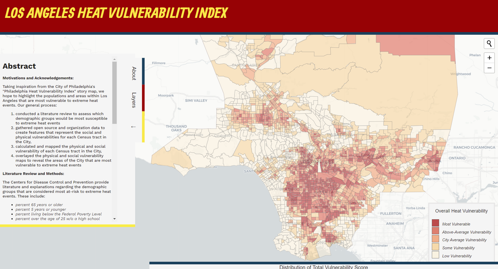

# Cole_Aidan_Extreme_Heat_Vulnerability_Index
For my final project, I will be generating an extreme heat vulnerability index for the city of Los Angeles. Taking inspiration from the City of Philadelphia's "Philadelphia Heat Vulnerability Index" story map, I hope to highlight the populations and areas within Los Angeles that are most vulnerable to extreme heat events. To do this, I will 1) conduct a literature review to assess which demographic groups would be most susceptible to extreme heat events, 2) gather open source data to create features that represent the social and physical vulnerabilities for each Census tract in the City, 3) calculate and map the physical and social vulnerability of each Census tract in the City, and 4) overlay the physical and social vulnerability maps to reveal the areas of the City that are most vulnerable to extreme heat events.

The Centers for Disease Control and Prevention provide literature and explanations regarding the demographic groups that are considered most at-risk to extreme heat events. These include: percent of population over 65 years of age, percent of population over 25 years of age with no high school education, percent of limited English-speaking households, percent of population below the Federal Poverty Level, percent of population that identifies as "non-white", percent of population over 65 years of age and living alone, percent of adults diagnosed with asthma, percent of adults diagnosed with Chronic Obstructed Pulmonary Disease, percent of adults diagnosed with Coronary Heart Disease, percent of adults diagnosed with diabetes, percent of adults diagnosed as obese, and percent of adults diagnosed with hypertension. Scores for each of these demographic features will range from 1 (lowest sensitivity) to 5 (highest sensitivity). In order to calculate a Census tract's physical vulnerability, I will use granular temperature data, as well as land-use (% tree canopy/impervious surfaces) and proximity features (ex. distance to community sprayground or cooling center). With the arbitrary physical and social vulnerability scores that I find for each Census tract, I will produce as my final deliverables 1) an executive briefing paper providing recommendations to the City as to where they should be concentrating their climate mitigation and adaptation efforts and 2) an interactive "beat-the-heat" resource tool to help bridge the gap between at-risk populations and said resources - illustrating the areas of Los Angeles that are most susceptible to extreme heat events and identifying important local community resources that exist to help people cope with or mitigate the effects of extreme heat. The ultimate goal of this project is to inform the City of Los Angeles of this multi-faceted issue and to help with the allocation of climate adaptive resources and strategies.

## Final Product

[View the site](https://bri-ne.github.io/LA-Heat-Vulnerability-Index/) 

[View the site's respository](https://github.com/bri-ne/LA-Heat-Vulnerability-Index)
